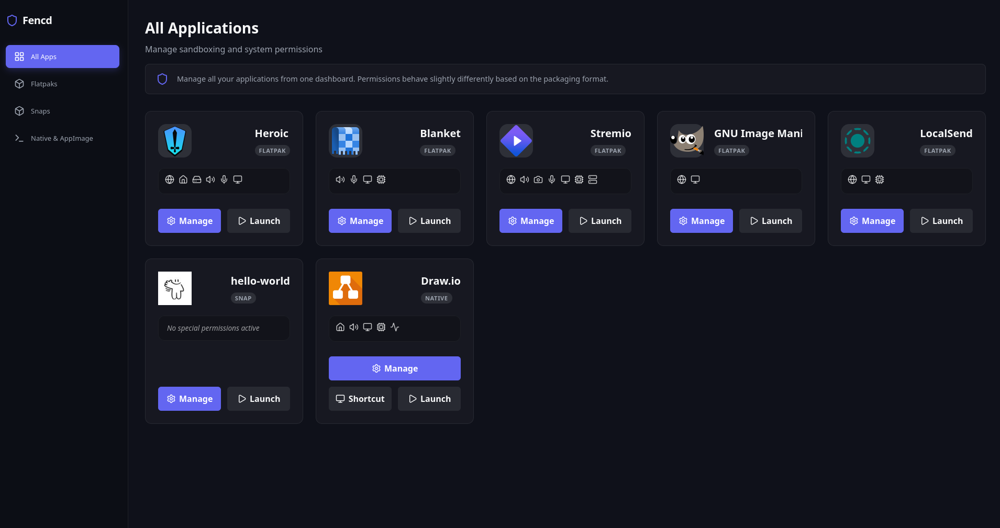

<p align="center">
  
</p>

<h1 align="center">Fencd</h1>

<p align="center">
  <strong>A powerful, unified application manager and sandboxing utility for Linux.</strong><br>
  Manage, launch, and strictly control the permissions of your Flatpak, Snap, and Native applications all in one place.
</p>

<p align="center">
  <a href="https://github.com/Ankit-692/fencd/releases">
    
  </a>
  
  
  
</p>

---

## 📖 Table of Contents

- [About Fencd](#-about-fencd)
- [App Screenshots](#-app-screenshots)
- [Key Features](#-key-features)
- [Download & Installation](#-download--installation)
- [Compatibility Notes](#️-compatibility-notes)
- [Building from Source](#️-building-from-source)
- [License](#-license)

---

## 🌟 About Fencd

**Fencd** is built for Linux users who want complete control over their applications. It brings your Flatpaks, Snaps, and Native executables (including AppImages) under one intuitive interface.

By leveraging [Bubblewrap (`bwrap`)](https://github.com/containers/bubblewrap), Fencd allows you to effortlessly sandbox untrusted binaries and `.AppImage` files, ensuring your system stays secure while giving you granular control over what each application is allowed to access.

---

## 📱 App Screenshots

<div align="center">



</div>

---

## ✨ Key Features

### 📦 Universal App Management
- **All-in-One Dashboard**: Seamlessly view and manage Flatpak, Snap, and Native applications from a single place.
- **Seamless Desktop Integration**: Automatically generate `.desktop` shortcuts and extract icons for your sandboxed Native apps and AppImages so they appear in your system's app launcher.

### 🛡️ Native & AppImage Sandboxing
- **Secure by Default**: Utilize the power of `bwrap` to securely sandbox native executables and `.AppImage` files without complex terminal commands.
- **Smart AppImage Handling**: Fencd automatically extracts AppImage contents safely and handles icons and runtime environments.

### 🎛️ Granular Permission Controls
Easily toggle application permissions on or off with a single click:
- Network Access
- Filesystem Access (Home / Host)
- Audio & Microphone
- Display & GPU Acceleration
- DBus Access & Camera
- Hardware Virtualization (KVM)

---

## 📥 Download & Installation

The fastest way to get Fencd on your Linux system:

<p align="center">
  <a href="https://github.com/Ankit-692/fencd/releases">
    
  </a>
</p>

### Prerequisites

To run Fencd and its sandboxes properly, your system must have:
* `bubblewrap` (Required for sandboxing Native apps and AppImages)
* `flatpak` (Optional, for managing Flatpaks)
* `snapd` (Optional, for managing Snaps)
* `webkit2gtk-4.1` (Required by the Wails framework for the UI)

### Installation Steps

1. Open the [**GitHub Releases Page**](https://github.com/Ankit-692/fencd/releases).
2. Download the appropriate package for your distribution (`.deb` for Ubuntu/Debian, `.rpm` for Fedora/openSUSE).
3. Install the package using your system's package manager:

```bash
# For Debian/Ubuntu based
sudo apt install ./fencd_0.1.0_amd64.deb

# For Fedora/RHEL/openSUSE based
sudo dnf install ./fencd_0.1.0_amd64.rpm
```

---

## ⚠️ Compatibility Notes

While Fencd aims to work on most modern Linux distributions, there are a few exceptions:

- **Older Distributions**: Systems shipping with older software repositories (e.g., Ubuntu 20.04) that only provide `webkit2gtk-4.0` may fail to run the UI unless built from source with an older WebKit tag.
- **Immutable Distributions**: OSes like **Fedora Silverblue/Kinoite, openSUSE MicroOS, vanillaOS, or SteamOS (Steam Deck)** restrict traditional host installations. You would need to use package layering (e.g., `rpm-ostree`) to install the `.rpm`. Furthermore, running Fencd itself *as a Flatpak/Snap* is currently unsupported due to complex nested sandboxing restrictions.
- **Missing Bubblewrap**: Any environment where `bubblewrap` is unavailable or blocked by the kernel (due to strict user namespace restrictions) will not be able to use the Native/AppImage sandboxing features.

---

## 🛠️ Building from Source

If you want to contribute or build Fencd yourself, make sure you have [Go](https://go.dev/) and [Node.js](https://nodejs.org/) installed, along with the [Wails CLI](https://wails.io/docs/gettingstarted/installation).

```bash
# Clone the repository
git clone https://github.com/Ankit-692/fencd.git
cd fencd

# Install frontend dependencies
npm install --prefix frontend

# Build the application
wails build -platform linux/amd64 -tags webkit2_41
```
*(Check `package.sh` for generating `.deb` and `.rpm` files using `nfpm`.)*

---

## 📄 License

This project is licensed under the MIT License.